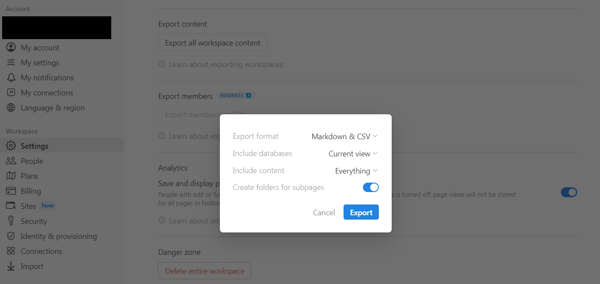
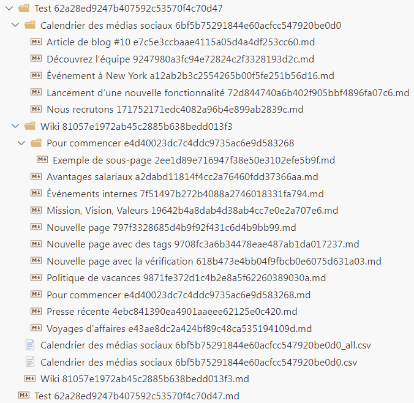
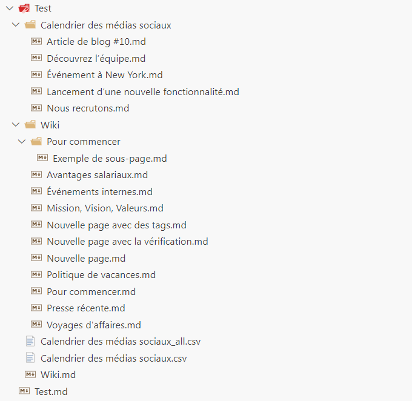

# Notion Export Cleaner

## Why ?

When exporting a [Notion](https://www.notion.so/) workspace, the resulting files come all with an additional suffix that uniquely identifies the page.
This is surely an internal ID that allows to rename pages without breaking links.
This may be useful for exports too, if you want to track changes between exports.
However, in a common use case of an export - to backup your pages - this is not that useful and makes the files harder to read.

This tools aims to rename the files to their original name, and remove the suffix.
It will add a suffix only if there are multiple pages with the same name.
It is not trivial, since you also need to edit all links everywhere in the files.

## How to use it ?

1. **Export :**
   You'll need to export your Notion workspace as markdown or html files, with subpages as folders.

> NB: you can also export as markdown or html _without_ subpages as folders. However, there will be a lot more name conflicts (multiple pages wanting to be called the same), so a lot more `My file`, `My file 1`, `My file 2`, etc.

1. **Unzip :**
   Once the export is done, you'll have a zip file. It may be difficult to unzip it, because of the huge file names. I found that usually `7-zip` is able to unzip it.

2. **Run the executable :**
   Inside a terminal, run the executable with the path to the folder containing the exported files as argument.
   `/path/to/notion-export-cleaner.exe /path/to/exported/folder`

## Example of output:

| Before | After  |
| ------ | ------ |
|  |  |